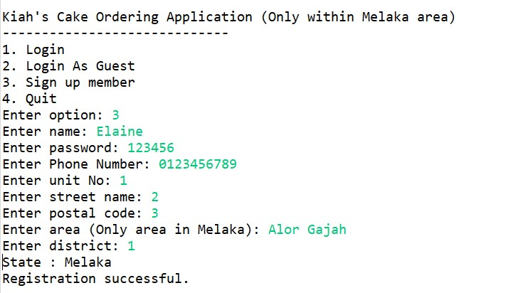

# Table of Content

* [Software testing assignment](#software-testing-assignment)

* [Dependencies](#dependencies)

* [Screenshots](#screenshots)

* [Authors](#authors)

  

# Software testing assignment

A group assignment that aims to learn:

- software testing (unit testing, integration testing, regression testing)

- testing frameworks (JUnit)

- uses of driver and stubs

  

A simple ordering command line application is built to carry out the testing part.

## Dependencies

- Java
- JUnit4
- mockito
- JUnitParams

## Screenshots

### Console Application

### Unit Testing, Integration Testing

#### Unit test cases in test suites

#### Integration testing

## Authors

* Elaine Low Jing Yi
* Low Ee Lyne
* Low Jia Wei
* Yeo Kai En

